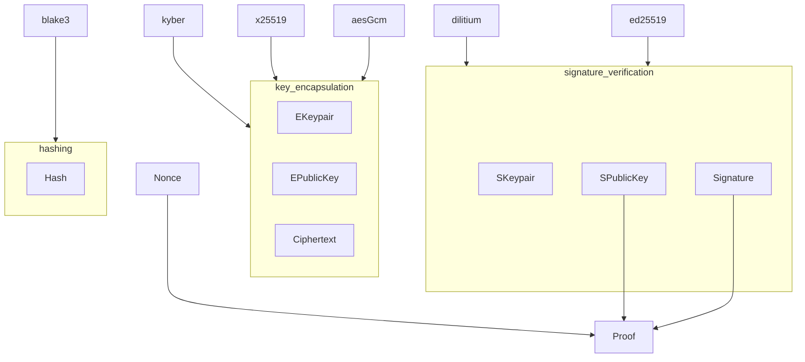
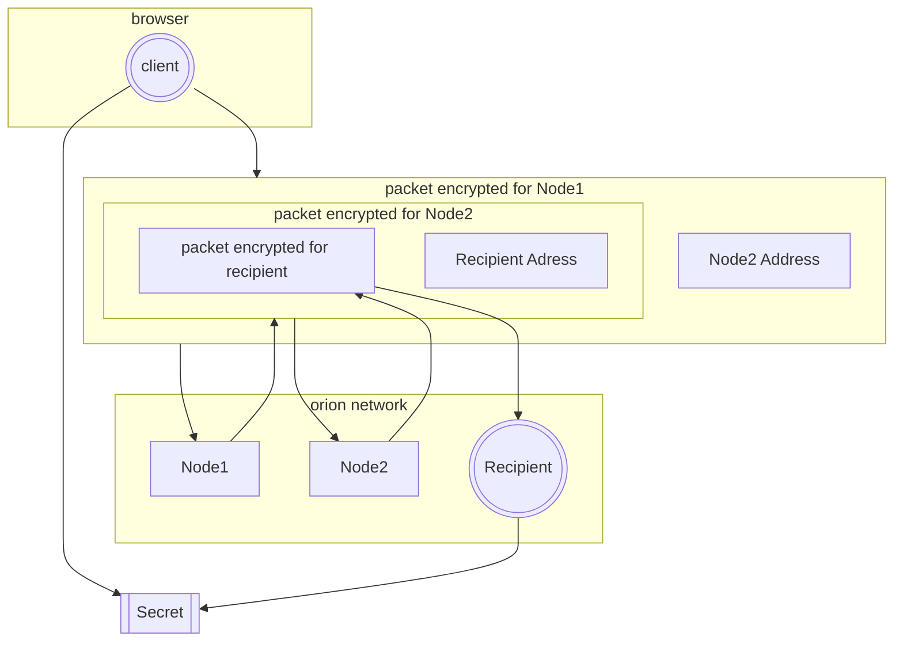
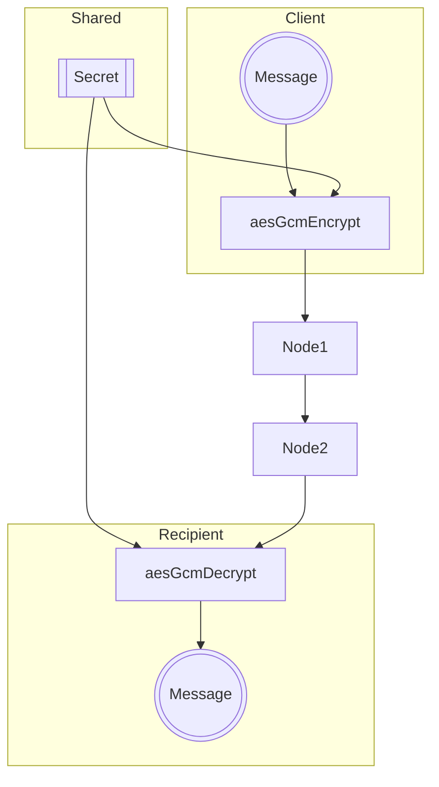
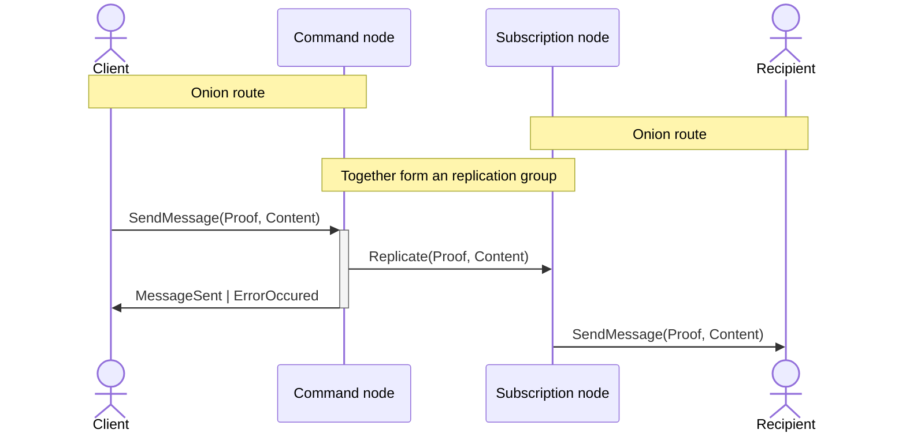
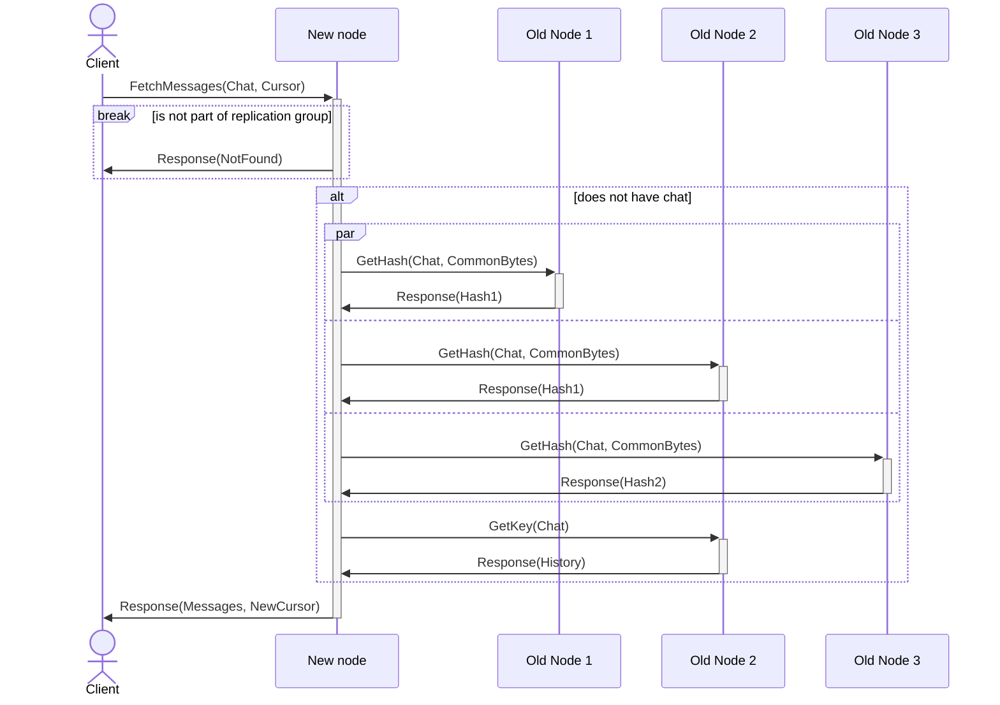
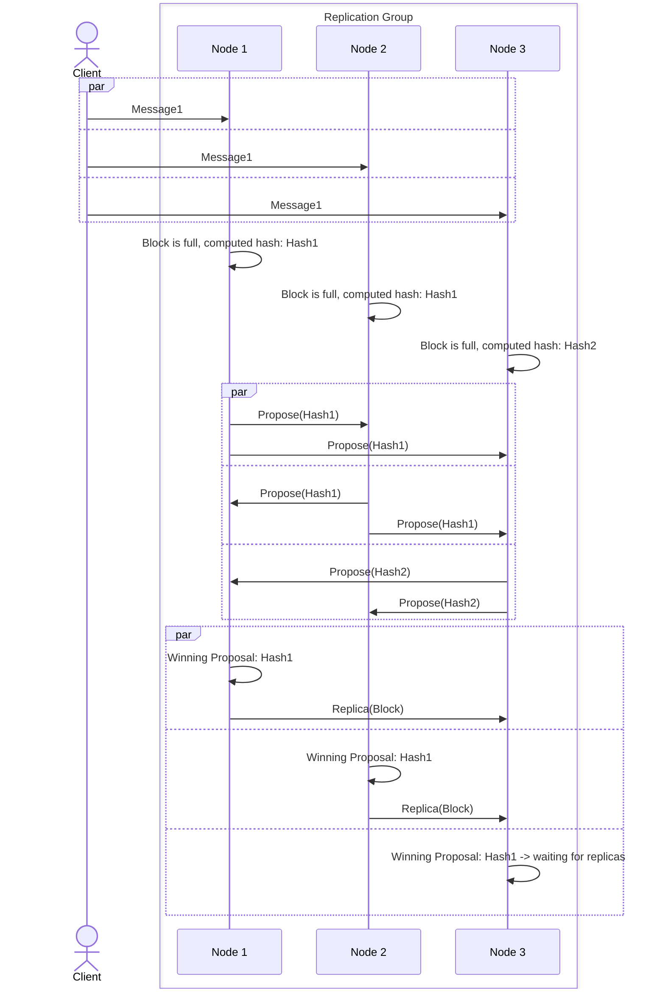
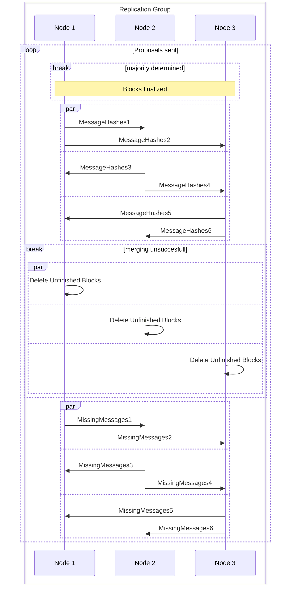
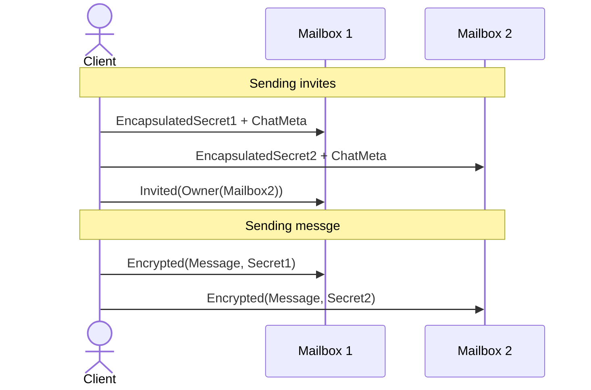
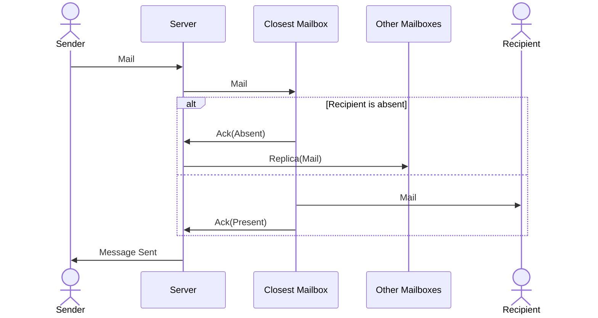

# The crypto protocols

## Fundamentals

### Core encryption primitives

### Onion routing

#### Setup

#### Communication

## Chat implementation comparison

### Central Buffer

The servers and also the recipient validate the proof attached to a message when it occurs. Problem appears when user retroactively reads the messages from the common buffer. Buffer cannot store the signatures for each message permanently since dilithium signatures are almost 5kb large. Malicious node can advertise false chat history to new nodes.

#### Lazy redistribution + Consistency voting

Lets go trough scenario where problems may occur:

- node enters/leaves the network
    - client connects to a node, since it discovers it as one of N closest nodes to data he is interested in
    - node does not have knowledge of this data due to it either being new or being pushed into replication group due to other node leaving
    - node tells client the chat does not exist (unwanted outcome)

To prevent this, requested node must verify its not supposed to have the data requested by querying closest nodes to the requested key. If the node is in fact in the group, it requests values from other nodes, majority of consistent values will be replicated and served to the client. The majority vote can be optimized to relief network bandwidth. Nodes will be sent common sequence of bytes which they combine with the hash of the value to be replicated and return that back to the requesting node. From majority matching hashes is one chosen to fetch the key.

#### Message blocks

One fundamental problem with introduced protocol is natural message ordering inconsistency. Some order needs to be established that nodes can easily agree on. We can think of messages as of transactions on a block-chain, taking every `M` messages, sorting them, and letting other nodes know about our hash. We send the hash so that nodes can determine the majority (`N/2 + 1`), each hash counts as a vote towards particular version of the block. When enough votes are collected each node either considers the block final, or discards its block and fetches it from all majority nodes.

Both parameters (`M`, `N`) need to be chosen to strike a balance between reliability and performance. Big `M` can reduce amount of validation cycles but highers the chance of blocks being out of sync. Higher `N` makes it harder to attack majority, but consumes increasing amount of network resources (`O(N)` memory and `O(N^2)` bandwidth.

#### Continuous validation

To increase resilience of the consensus, nodes should send block characteristics to other nodes while replicating an message. Simplest metric of accuracy is amount of messages currently in block (total size of the block can be also considered), main characteristic of a metric is that it does not depend on the order of messages and is easily computable. In this case, the node with the most messages is the winner and will send hashes of the messages to the lacking nodes, that will in turn diff their messages and send hashes of missing messages back. Restored messages need to be flagged as restored to the user as they can appear out of order in which they were sent, the position is determined by adjacency of message hashes. Possible attack vector is fake message flooding. Malicious node could fabricate messages and force others to store them, and for this we again abuse majority to help drive decisions. Wether node is behind can be calculate as median of all message counts. In cases where message hashes miss some messages that lacking node has one of the two options might have happened:

- both nodes are honest and they each missed a different message
- source of hashes cannot be trusted

This should be decided by a threshold function `t`. Update is accepted when `|missing_hashes| + |missing_messages| < t(|{hash(m) for m in messages, hashes}|)`

#### Handling majority failure

If we want to use lower `N` there is increasing chance of undecidable state occurring. For example, `N = 3` (absolute minimum) and all three nodes have different hash. At this point, every node will proactively share the message hashes of messages and then apply common algorithm to resolve collisions. If two nodes of he group are honest, its likely they have similar chat histories and they can merge the histories. We use the process from previous section. If all updates are denied, nodes propose and then discard all unfinished blocks as a last resort recovery rather then clogging the message creation forever.

## Message multiplexing

Previous solution assumes majority of nodes are legitimate which is traded for performance. This implementation needs only one node in replication group to be honest though cannot be scaled to as many users. Instead of servers maintaining the state of the chat, members of the chat are remembered by each user along with history of messages. When inviting a user, the cached secret key is send along with the chat metadata to invitees mailbox, other users also receive message about this to their mailboxes. When removing a member, each user will validate this for themself and remove the user from recipients -> not sending the messages for the excluded user is enough since every user has separate secret.

## Mail To Online Users

Users subscribe to their mailbox when online, we can use the fact to avoid unnecessary replication of the mail. Node that serves the mail sender requests will first make an RPC call to the closet node to the client, if this node responds with subscribed client being present, this is last call in the process. Otherwise the server will also sends the mail to the rest of the replication group.

# Optimizations

Optimizing the network is crutial for user experience and redustion of costs for miners. In case of decentralized network, we strive to reduce amount of comunication between nodes. The most used protocol in the architecture is DHT, that ensures we know where to store and find data. The simplest way of finding nodes is performing the query each time we are looking for a group of nodes. Lackly DHT maintains a routing table that mignt ont be always up to date, though, since entering the network requires staking, we can assume nodes will not enter and exit the network often. This allows us to consider topology change as a cold path and optimize for common case where we have up to date routing table.

## Query on Failure

Only way outdated routing table can cause the request to fail is when peer no longer interested close enough to the request topic receives the request. TO prevent this, we want to maximize the chance of finding out we are serving to the wrong node:

- recipient checks with his routing table whether it is supposed to serve the request (by topic)
  - if he isnt, he reports his list of closest nodes to the sender, sender will diff the list and send request to nodes it missed
    - if new topology obtained from the other node also fails, meaning both nodes are outdated, node will fall back to query and not only send the request but also notify other node baout the failure as a repairing mechanism
- recipient also checks, if this is request internal to replication group, whether sender is withing the topic
  - if he isnt, kad lookup is performed, since this can be melacious request, to validate the node in fact is supposed to send the request and routing table is outdated
    - if table is not outdated and requester is in fact not part of the group, request is denayed and for next time period `P` we ignore such requests from the given peer as a ratelimmiting mechanism

All of these points though are fallback mechanisms, each node should maintain his mapping of nodes obtained form the chain and also listen on events about new nodes joining te network. If the node taht connects to any miner isn't within the staking node list, the connecton is dropped. With full list of nodes we should have good idea about the topology and almost never query for peers.
